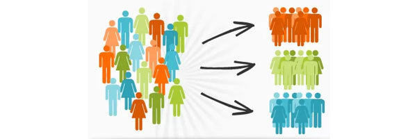
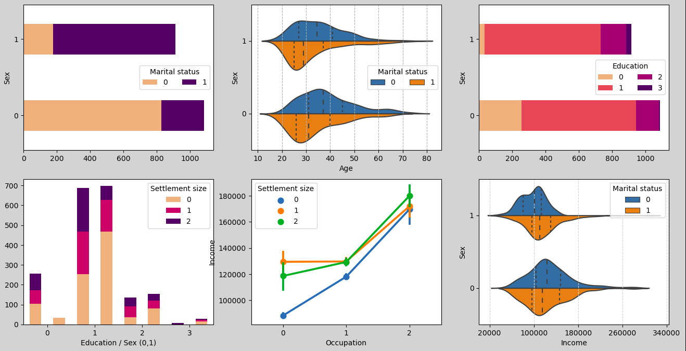
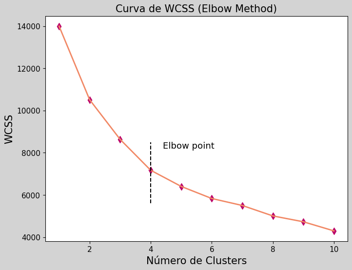
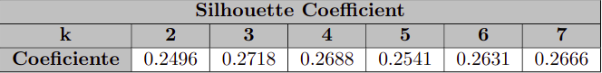
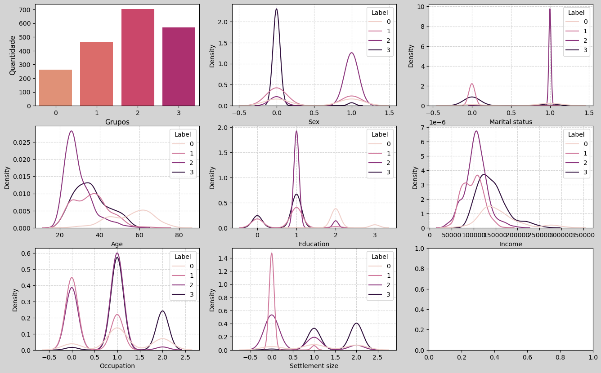

# Customer Clustering

Este projeto utiliza a técnica de aprendizado não-supervisionado denominado como clusterização, tal técnica busca agrupar elementos dentro de um conjunto de dados conforme padrões observados pela máquina. Mais especificamente, iremos atuar na área de segmentação de clientes, cujo estudo está direcionado aos padrões entre diferentes clientes ou usuários de um serviço. Para isso, é necessário levantar informações a respeitos dos indivíduos, as quais estão contidas dentro das classes $\textbf{Comportamentais, Demográficas, Psicológicas,}$ e entre outras que são utilizadas para interesses mais particulares. A segmentação de clientes é um importante processo dentro das empresas, seus resultados geram insights para diferentes setores como o Marketing e Negócios, auxiliando em decisões relevantes.

## 1. Introdução

Neste projeto foi utilizado dados de uma rede de super-mercados norte americana focada em vendas de produtos "FMCG", na tradução "Bens de consumo rápido", estes foram coletados a partir do cadastro de clientes em cartões de fidelidade, os dados contém informações da classe demográfica dos clientes, como a idade, o sexo, o estado civil, o nível de educação, o salário anual, a ocupação e o tamanho da cidade. O conjunto está disponível no Kaggle e pode ser acessado pelo link [Dados Kaggle](https://www.kaggle.com/datasets/dev0914sharma/customer-clustering). 

Após aplicações de ferramentas de exploração e visualização de dados compreendemos que existia potenciais grupos no cojunto, então, com o auxílio das técnicas $\textbf{Elbow}$ e  $\textbf{Silhouette}$ evidenciamos a presença de 4 clusters, a segmentação foi realizada com o método de aprendizado não-supervisionado $\textbf{KMeans}$, cuja performance nos revelou perfis leais ao estabelecimento e perfis potenciais para compras. Com base nisso, concebemos possíveis estratégias para serem implementadas pela rede de super-mercados afim de converter os clientes potenciais em compras e aumentar a frequência de aquisição de clientes leais. 

## 2. Objetivos

O principal objetivo, consiste em gerar insights para o setor de marketing desse estabelecimento, evidenciando os clientes-alvos, e auxiliando na tarefa de construir uma estratégia eficaz. No entanto, no decorrer do projeto buscamos atingir alguns objetivos específicos, tais como:

- Explorar os dados e com isso explicar possíveis clusters que irâo surgir;

- Estudar as maneiras de se obter o número ótimo de grupos em meio aos dados;

- Realizar a clusterização e construir os perfis dos clientes de cada grupo;

- Definir estratégias eficientes com base nos perfis;

- Implementar um método de classificação de novos clientes.

## 3. Métodos

Os métodos aplicados neste projeto e a construção dos notebooks foram baseados nas etapas $\textbf{crisp-dm}$, as quais compreendem:

1. Entendimento do negócio;
2. Entendimento dos dados;
3. Preparação dos dados;
4. Modelagem;
5. Avaliação;
6. Implementação.

## 4. Desenvolvimento

### Entendimento dos Dados

Na etapa de entendimento dos dados utilizamos como base o dicionário disponibilizado pelo site [data_dictionary](https://docs.google.com/spreadsheets/d/1dP1ZB_Yuv610Fa1aw_rCSYrsighS44VB/edit?usp=sharing&ouid=105591099330593823176&rtpof=true&sd=true), em resumo temos que as colunas indicam:

  - **ID**: Representa a identificação de cada cliente dentro do ambiente de gerenciamento do cartão;

  - **Sex**: Representa o sexo biológico do cliente {0,1}, onde 0 é masculino e 1 feminino;

  - **Marital Status**: Representa o estado civil dos cliente {0,1}, em que 0 é solteiro e 1 outros estados civis;

  - **Age**: Representa a idade dos clientes;
  
  - **Education**: Representa o nível de escolaridade dos clientes {0,1,2,3}, em que 0 estão os níveis desconhecidos/outros, 1 até o ensino médio, 2 até a graduação e 3 até pós-graduação;

  - **Income**: Representa a renda salarial anual dos clientes em dólares;

  - **Occupation**: Representa o tipo de trabalho que o cliente atua {0,1,2}, onde 0 são desempregados/trabalho não qualificado, 1 são empregos qualificados/servidor e 2 são trabalhos muito qualificados/autoridades/administradores;

  - **Settlement size**: Representa o tamanho da cidade em que o cliente mora {0,1,2}, 0 cidades pequenas, 1 cidades de porte médio e 2 grandes cidades.

Avaliamos a estrutura dos dados estudando a presença de outliers, dados duplicados, dados desbalanceados ou valores faltantes, não identificamos nenhuma avaria, desse modo, prosseguimos para a exploração dos dados por meio da visualização gráfica com as bibliotecas **Matplotlib.pyplot** e **Seaborn**. Observamos as seguintes distribuições:

Conseguimos extrair algumas informações de possíveis grupos dentre os clientes:

  - **Grupo 1**: A maioria dos homens estão solteiros por volta dos 35 anos, moram em cidades maiores e oculpam cargos com altos salários.

  - **Grupo 2**: Uma grande parte das mulheres estão em relacionamentos aos 30 anos, residem em maioria em pequenas cidades e trabalham em cargos com salários mais baixos.

Além disso, obtemos algumas nuances a respeito das condições vividas pelos clientes, tais como:

  - Os salários para cargos iguais se difere pelo tamanho das cidades, de forma que as cidades menores oferecem salários menores;

  - As mulheres em média possuem níveis de educação mais altos que os homens, mas preferem residir em cidades menores.

### Modelagem

Primeiramente, realizamos a etapa de determinação do número de grupos no conjunto, utilizamos as métricas de **WCSS** e o **Silhouette Coefficiente** para diferentes valores de k (número de grupos) e avaliamos a melhor performance. 

O funcionamento e a base de cálculo das métricas estão explicadas em detalhes no [notebook](https://github.com/Edmurcn/Customer-Clustering/blob/main/notebooks/2.modeling.ipynb), resumidamente, **Elbow Method** avalia o ponto de reflexão da curva da medida de WCSS cuja base está na dispersão do cluster, já o **Silhouette Method** busca a maximização do valor do coeficiente de silhueta cujo cálculo leva em consideração a intersecção dos grupos. Abaixo apresentamos os resultados obtidos pelos métodos.

  

    
  

  

    
  

   

De acordo com os métodos podemos concluir que o número ideal de grupos existentes no conjunto é k = 4. Por mais que o coeficiente de silhueta é maior para k = 3, a análise foi feita em conujunto com o outro método, sendo assim, avançamos com o número citado e avaliamos o desempenho. A partir disso, aplicamos a clusterização aos dados; a princípio foi escolhido o modelo **KMeans**, por demonstrar alta performance com resultados fáceis de interpretar. Após o processo de segmentação, foi agregado ao conjunto uma coluna indicando as classes de cada cliente, o que possibilita a análise dos perfis classificados.

 

### Avaliação

Na etapa de avaliação do desempenho do modelo, vamos utilizar gráficos de densidade de cada coluna dos dados, filtrando com base na coluna dos grupos criada na etapa anterior. O conjunto de gráficos construídos, juntamente com o gráfico da população de cada grupo dentre a gama de clientes está disposto abaixo:

Com base na visualização acima, levantamos os perfis de cada cluster presente no conjunto:

<table style="border-collapse: collapse; width: 100%;">
  <tr>
    <td style="width: 50%; vertical-align: top; padding: 10px; border: none;">
      <strong>Cluster 0</strong>
      
- Contidas no cluster 0, estão pessoas de sexo diverso, com idades superiores a 40 anos, que por sua vez, possuem uma boa educação ocupam em maioria cargos mais elevados com salários maiores e moram em cidades variadas;

      
- Podemos dizer que são pessoas já estabelecidas que possuem uma rotina estável, sem muitos gastos excessivos ou fora do comum.

        
      <strong>Cluster 1</strong>
      
- No grupo 1 encontramos clientes que em sua grande maioria estão solteiras, possuem idades entre 30 e 40 anos, ocupam cargos menores com salários mais baixos, em que não precisam de tanta escolaridade, além disso, praticamente todos moram em cidades menores;

      
- Concluímos que são pessoas que talvez estejam estabelecidas em cargos menores, ou iniciando sua carreira profissional. Por outro lado, são mais jovens e estão mais propícias a realizarem compras voltadas a gastos superficiais.

    </td>
    <td style="width: 50%; vertical-align: top; padding: 10px; border: none;">
       
      <strong>Cluster 2</strong>
      
- A respeito do cluster 2, cujo está presente a maioria dos clientes, temos em grande parte mulheres com idade inferior a 40 anos dentro de um relacionamento, com nível de escolaridade mediano, ocupando cargos medianos com pequeno salário, sendo que a maioria mora em pequenas cidades;

      
- Conseguimos atribuir a este perfil possíveis jovens mães ou somente jovens casadas que provavelmente se encarretam de realizar as compras da família. Além disso, são pessoas que têm maiores chances de aproveitar promoções rotineiras visto uma maior frequência de visitas ao estabelecimento.

      <strong>Cluster 3</strong>
      
- Os clientes pertencentes ao grupo 3, são majoritariamente homens solteiros com idade em torno de 40 anos, cuja educação é mediana, porém ocupam cargos grandes e possuem maiores salários, também residem em grandes cidades;

      
- Identificamos estes clientes como homens que estão em busca de oportunidades de avanço profissional em grandes centros, dessa forma, provavelmente precarizam sua alimentação por conta da produtividade e isso faz com que busquem por alimentos mais acessíveis.

    </td>
  </tr>
</table>

### Implementação

